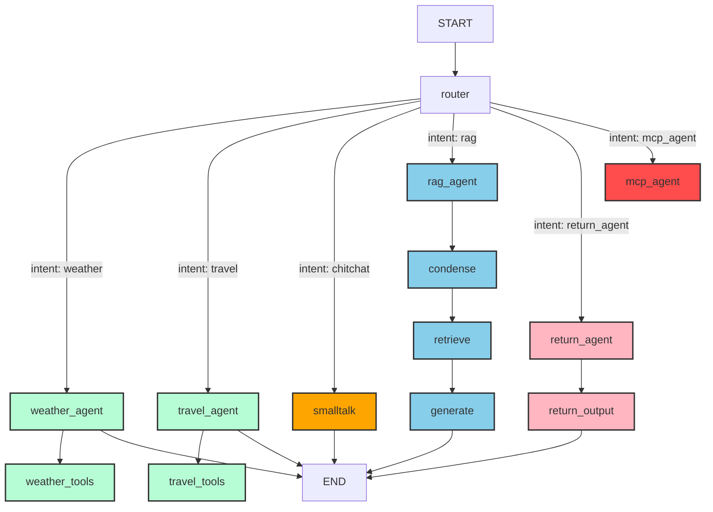

# LangGraph Multi-Agent Reference Implementation

This repository provides a **reference implementation of a multi-agent system** built with [LangGraph](https://github.com/langchain-ai/langgraph).  
It is intended as a **learning resource** for agent architectures and can also be used for **rapid prototyping** and **proof-of-concepts**.
The MCP Integration is based on [LangChain MCP Adapters](https://github.com/langchain-ai/langchain-mcp-adapters).

The Agent can be exposed
 * via Command Line
 * via REST API (FastApi)
 * via Chat Website (Streamlit)
---

## Architecture Overview



---

## Agent Concepts

- **Intention-Based Routing**  
  - Detects intent and routes to the appropriate sub-agent.  
  👉 [router_node.py](src/pocketagent/router_node.py)

- **RAG Agent**  
  - Retrieval-Augmented Generation.  
  - Answers product-related questions.  
  - Data source: `product_faq.md`  
  - Vectorized with **FAISS**.  
  👉 [ragbot.py](src/pocketagent/ragagent/ragagent.py)

- **Form / Workflow Wizard**  
  - Collects information like a form or guided workflow.  
  - Detects when all required fields are filled.  
  - Example: Return process → collects *email* + *order ID*.  
  👉 [wizardagent.py](src/pocketagent/returnagent/wizardagent.py)

- **Small Talk Agent**  
  - Just does some small talk.  
  👉 [smalltalk_node.py](src/pocketagent/smalltalk_agent/smalltalk_node.py)  


- **Tool Agents**  
  - Call external (mock) tools.  
  - Examples: Weather queries, hotel lookup.  
  👉 [weather_tools.py](src/pocketagent/TravelAgent/agent.py)  


- **MCP Agent**  
  - Queries a [Model Context Protocol (MCP)](https://github.com/modelcontextprotocol) server for available tools.  
  - Includes a minimal MCP server implementation.  
  👉 [pocketagent_cli.py](src/mcpagent/mcpagent.py)

---

# Getting Started

# Run on Linux & Mac & Windows WSL

## Initialize Environment
```bash
git clone https://github.com/Qrist0ph/pocketagent.git
```
```bash
cd pocketagent
```

```bash
python3 -m venv .venv
```

```bash
source .venv/bin/activate
```

```bash
pip install -r requirements.txt
```

```bash
export OPENAI_API_KEY=sk-123456789abcdef
```

## Run via Command Line
```bash
python3 src/pocketagent_cli.py 
```


## Run API:

```bash
uvicorn src.api.index:app --reload
```

Docs: [http://127.0.0.1:8000/docs](http://127.0.0.1:8000/docs)


## Run Streamlit :

```bash
streamlit run src/streamlit/chatbot.py 
```

http://localhost:8501/


## Agent2Agent Server

```bash
python3 src/a2a/__main__.py 
```bash

http://localhost:10000/.well-known/agent-card.json